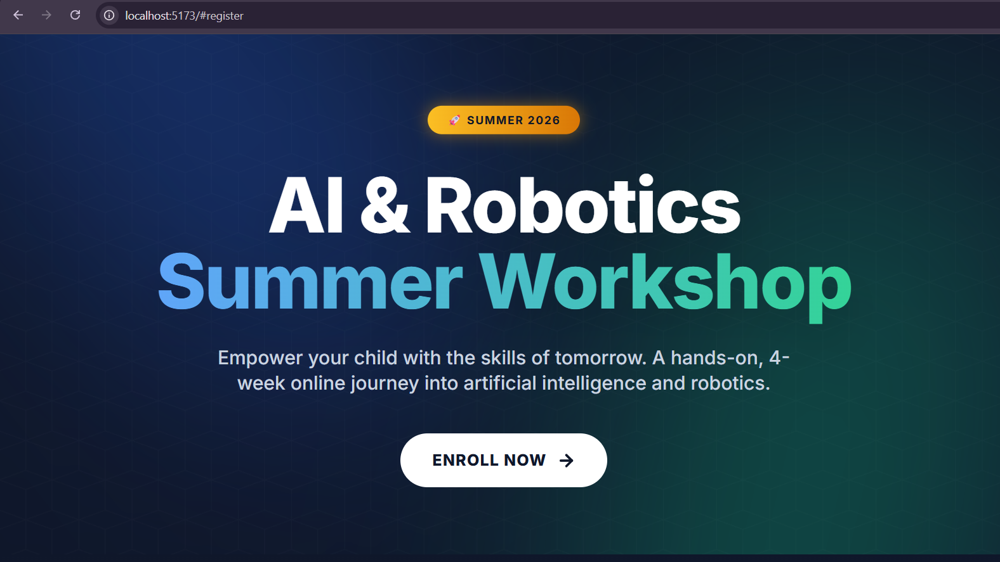
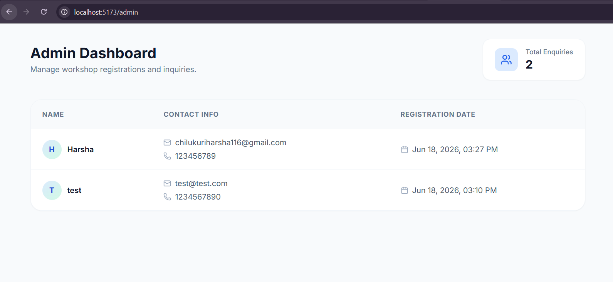

# Kidrove: AI & Robotics Summer Workshop

This is a full-stack web application developed for the Kidrove Workshop assignment. The project features a highly animated, responsive landing page and a secure backend API for managing student registrations.

## Tech Stack
- **Frontend**: React.js (Vite), TypeScript, Tailwind CSS, Framer Motion, React Hook Form, Zod, React Router
- **Backend**: Node.js, Express.js, TypeScript, MongoDB (Mongoose), Zod validation

## Approach & Architecture
*(Add your screenshots here!)*




My approach focused on creating a premium, engaging user experience tailored for a children's tech workshop while maintaining strict engineering standards. For the frontend, I utilized React with Framer Motion and Tailwind CSS to implement a modern "glassmorphism" design with continuous micro-animations, ensuring the UI feels dynamic without sacrificing performance. 

For the backend, I implemented a robust Express REST API with MongoDB integration. Data integrity was prioritized by utilizing Zod for strict schema validation on both the client and server sides, ensuring that only verified data enters the database. I also built a dedicated React Router `/admin` dashboard to easily view incoming registrations.

## Future Improvements (If Given More Time)
1. **Authentication**: Implement JWT-based secure login and session management for the Admin Dashboard to protect student data.
2. **Email Integration**: Integrate an email service (e.g., Resend or SendGrid) to automatically send a welcome/confirmation email to parents upon successful registration.
3. **Payment Gateway**: Add Stripe or Razorpay integration to securely process the ₹2,999 workshop fee directly during the registration flow.
4. **Testing Suite**: Implement comprehensive unit tests using Jest/Vitest and end-to-end tests using Cypress.

## Project Structure

```text
kidrove-workshop/
├── client/                     # React Frontend
│   ├── public/                 # Static assets (images, icons)
│   ├── src/
│   │   ├── components/         # Reusable UI components (Hero, DetailsGrid, FAQ, etc.)
│   │   ├── pages/              # Route pages (LandingPage, AdminDashboard)
│   │   ├── App.tsx             # Main React Router setup
│   │   ├── index.css           # Global Tailwind CSS and custom animations
│   │   └── main.tsx            # React DOM entry point
│   ├── tailwind.config.js      # Custom theme colors and Tailwind plugins
│   └── package.json            # Frontend dependencies
│
├── server/                     # Express Backend
│   ├── src/
│   │   ├── controllers/        # API route handlers (enquiryController)
│   │   ├── models/             # Mongoose schemas (Enquiry model)
│   │   ├── db.ts               # MongoDB connection logic
│   │   └── index.ts            # Express server setup and routes
│   ├── .env                    # Environment variables (Mongo URI, Port)
│   ├── tsconfig.json           # TypeScript configuration
│   └── package.json            # Backend dependencies
└── README.md                   # Project documentation
```

## Setup Instructions

### Prerequisites
- Node.js (v18+)
- MongoDB running locally on port 27017

### Installation & Running
1. Install dependencies for the backend:
   ```bash
   cd server
   npm install
   ```
2. Start the backend server (runs on port 5000):
   ```bash
   npm run dev
   ```
3. Open a new terminal and install frontend dependencies:
   ```bash
   cd client
   npm install
   ```
4. Start the frontend development server:
   ```bash
   npm run dev
   ```
5. View the app at `http://localhost:5173` and the dashboard at `http://localhost:5173/admin`.
